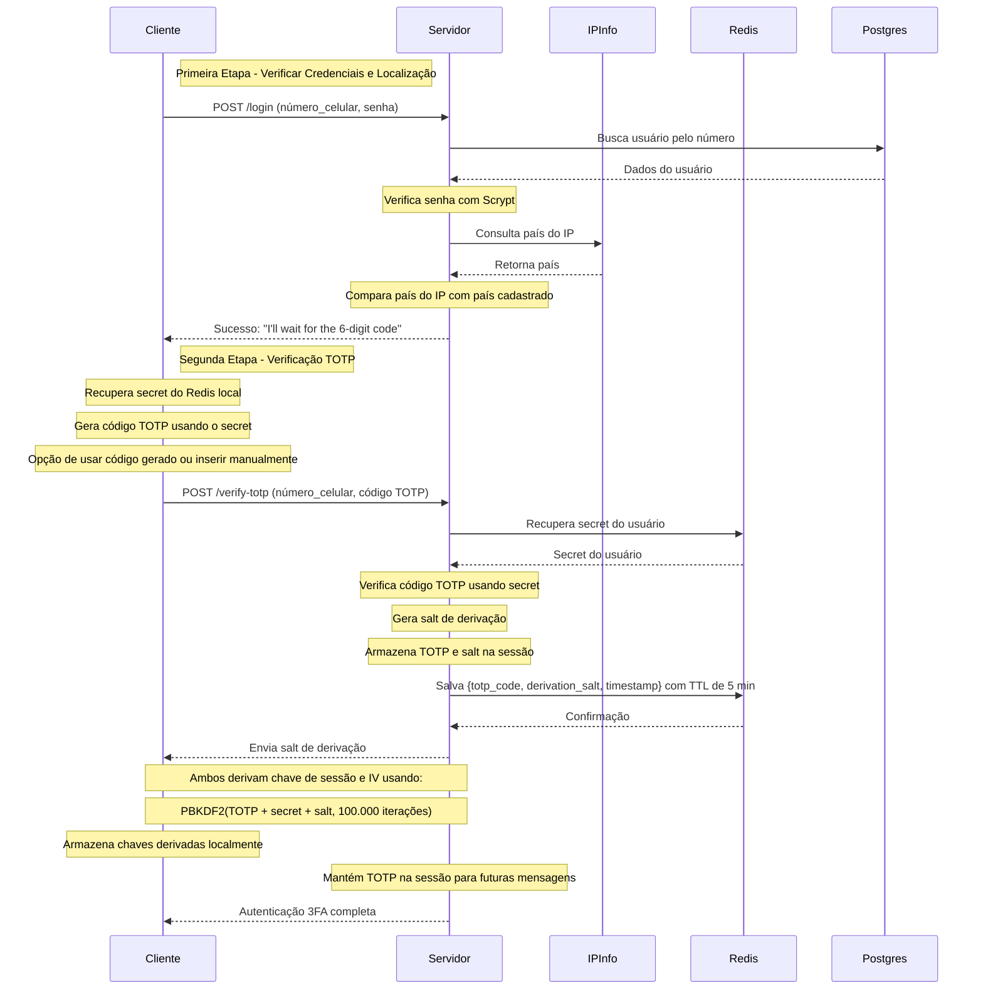
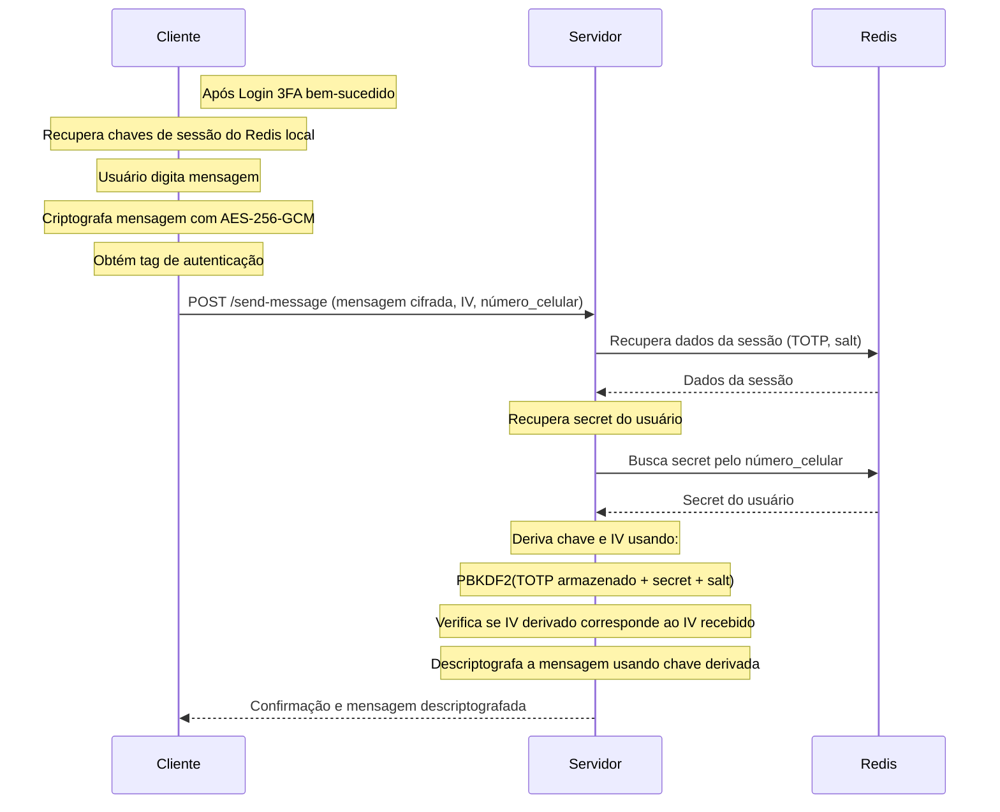

# Sistema de Autenticação 3FA com TOTP e Criptografia

Este projeto implementa um sistema de autenticação de três fatores (3FA) que inclui:
1. Fator de localização (IP/país)
2. Fator de conhecimento (senha)
3. Fator de posse (código TOTP)

Após a autenticação bem-sucedida, o sistema permite o envio de mensagens criptografadas usando chaves derivadas de TOTP.

## Requisitos

- Node.js (v18 ou superior)
- Docker e Docker Compose
- npm ou yarn

## Estrutura do Projeto

- **src/**: Backend da aplicação com API REST
- **client/**: Cliente interativo para testar o sistema

## Configuração Inicial

### 1. Instalação das Dependências

```bash
npm install
```

### 2. Configuração do Ambiente

Crie um arquivo `.env` na raiz do diretório com as seguintes variáveis:

```
# Porta do servidor
PORT=3000

# Configuração PostgreSQL
POSTGRES_USER=postgres
POSTGRES_PASSWORD=postgres
POSTGRES_DB=app_db
POSTGRES_HOST=localhost
POSTGRES_PORT=5433

# URLs do Redis
REDIS_SERVER_URL=redis://localhost:6381
REDIS_CLIENT_URL=redis://localhost:6380

# Chave de API do IPInfo (obtenha em https://ipinfo.io/signup)
IPINFO_API_KEY=sua_chave_ipinfo_aqui
```

## Executando a Aplicação

### 1. Iniciando os Containers Docker

Primeiro, inicie os containers Docker que hospedam o PostgreSQL e os dois Redis (Redis do Cliente e Redis do Servidor):

```bash
docker-compose up -d
```

Este comando iniciará:
- PostgreSQL (porta 5433)
- PgAdmin (porta 8080)
- Redis do Servidor (porta 6380)
- Redis do Cliente (porta 6381)

Verifique se os containers estão rodando:

```bash
docker-compose ps
```

### 2. Iniciando o Servidor

Após os containers estarem em execução, inicie o servidor:

```bash

npm run dev
```

O servidor estará disponível em `http://localhost:3000`

### 3. Executando o Cliente Interativo

Em um novo terminal, execute o cliente interativo:

```bash

npm run client
```

## Utilizando o Cliente Interativo

O cliente interativo oferece um menu com as seguintes opções:

1. **Registrar novo usuário**: Cria um novo usuário no sistema
2. **Login completo (3FA)**: Realiza autenticação completa com 3 fatores
0. **Sair**: Encerra o cliente

### Fluxo de Uso Típico

1. Registre um novo usuário (opção 1)
2. Realize o login completo (opção 2)
3. Envie uma mensagem criptografada quando solicitado

## Simulação de Diferentes Localizações

O cliente oferece duas opções para o endereço IP usado nas requisições:

1. **Usar o IP real do usuário:**
   - Detecta e utiliza automaticamente o IP público real da sua conexão
   - Útil para testes reais de verificação geográfica

2. **Simular IPs de diferentes países:**
   - Brasil: 200.152.38.1
   - EUA: 8.8.8.8
   - UK: 176.32.103.205
   - Japão: 203.104.153.1
   - Opção para digitar manualmente qualquer IP

Durante o registro ou login, o cliente perguntará qual IP você deseja utilizar, permitindo escolher entre seu IP real ou um IP simulado.

Para testes mais avançados de localização, recomenda-se o uso de uma VPN para alterar fisicamente o IP real.

## Acesso ao PgAdmin

Para gerenciar o banco de dados PostgreSQL:
1. Acesse `http://localhost:8080`
2. Faça login com:
   - Email: admin@admin.com
   - Senha: admin
3. Adicione um novo servidor:
   - Host: postgres-db
   - Porta: 5433
   - Usuário: postgres
   - Senha: postgres
   - Database: app_db

## Parando a Aplicação

Para parar os containers Docker:

```bash
docker-compose down
```

## Detalhes Técnicos

- Hash de senha: Algoritmo Scrypt
- Geração TOTP: Biblioteca otplib
- Criptografia de mensagens: AES-256-GCM
- Armazenamento de secrets: Redis
- Detecção de país: API IPInfo
- Framework Backend: Hono
- ORM: Drizzle ORM
- Derivação de chaves: PBKDF2 (100.000 iterações, SHA-256)

## Fluxos do Sistema

### 1. Fluxo de Registro de Usuário


### 2. Fluxo de Login com TOTP



### 3. Fluxo de Mensagem Criptografada

